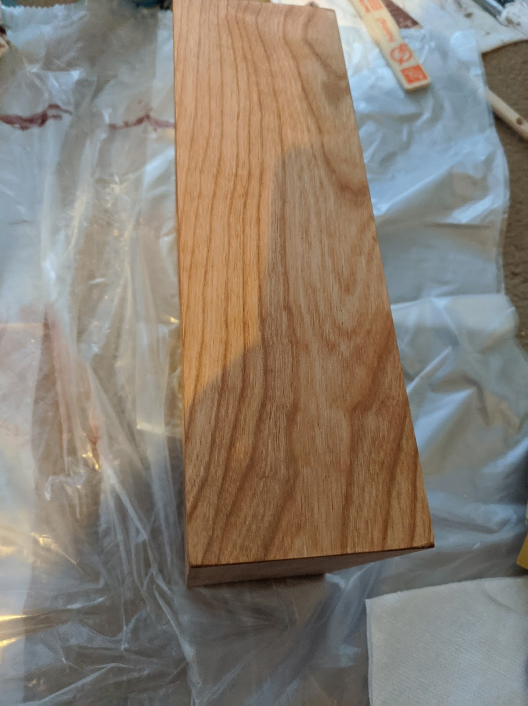
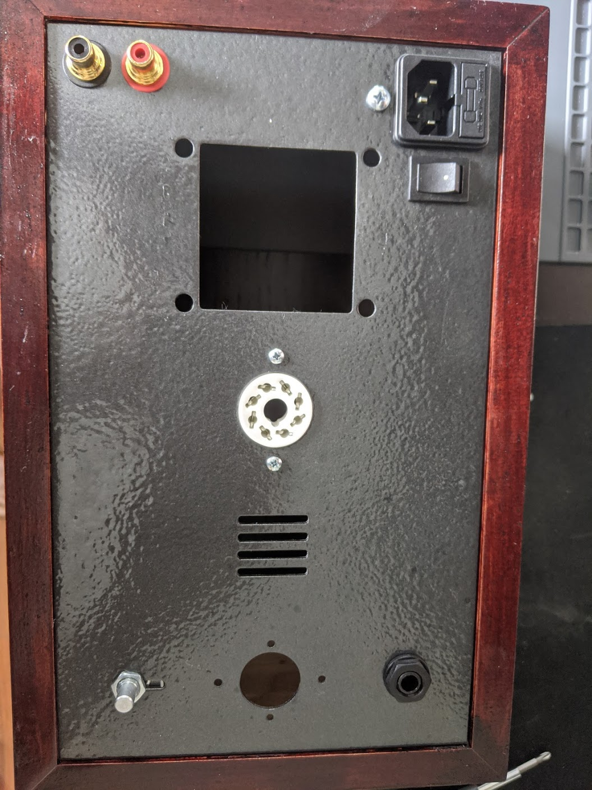
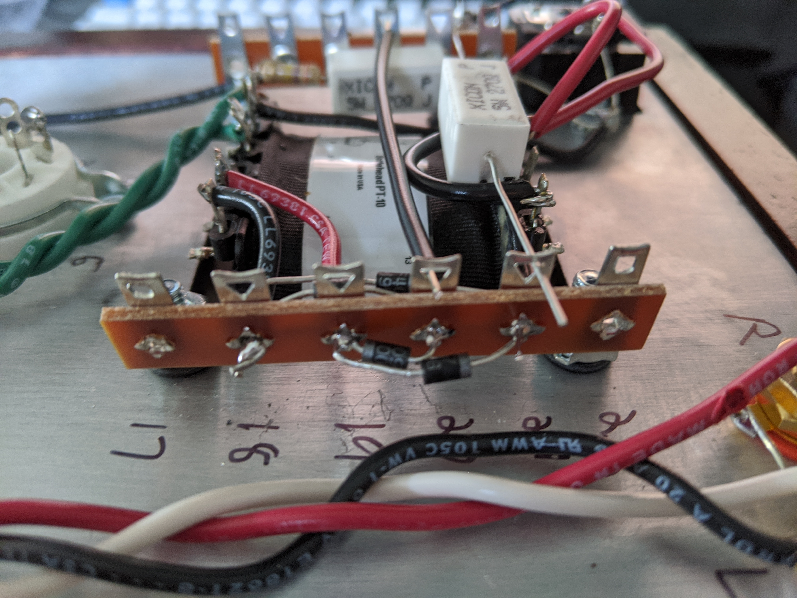
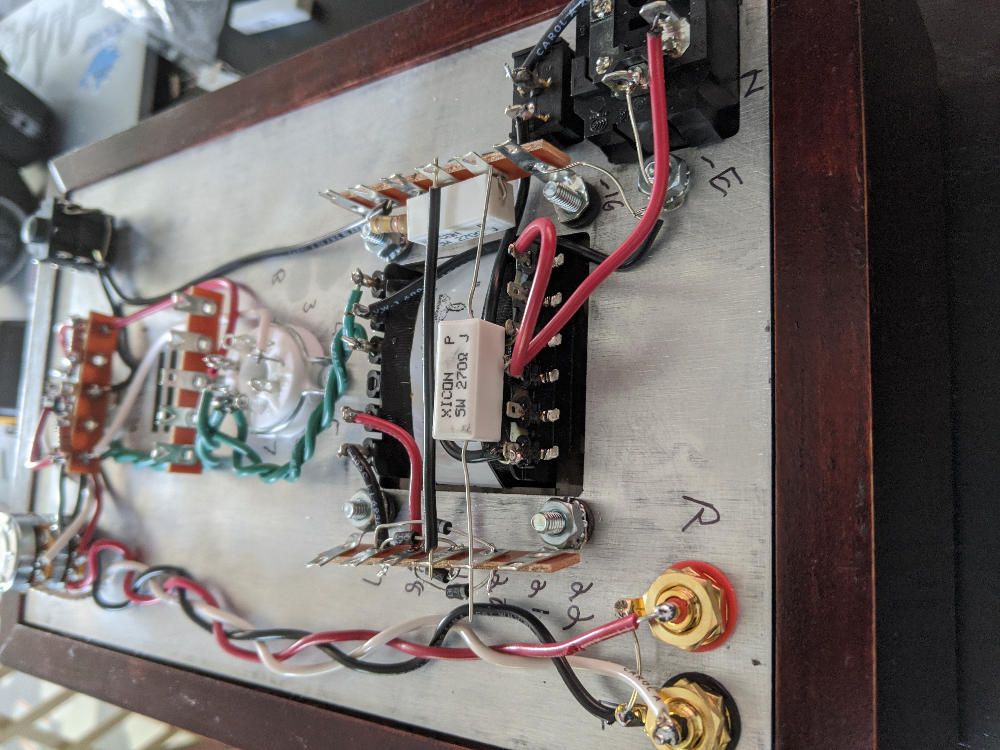
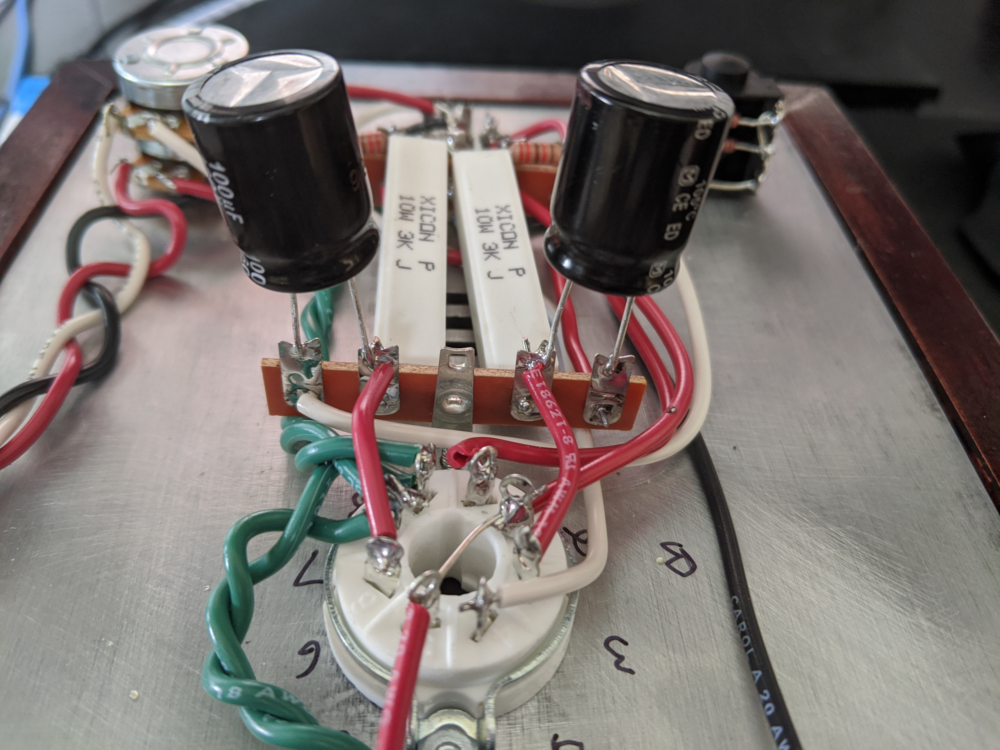
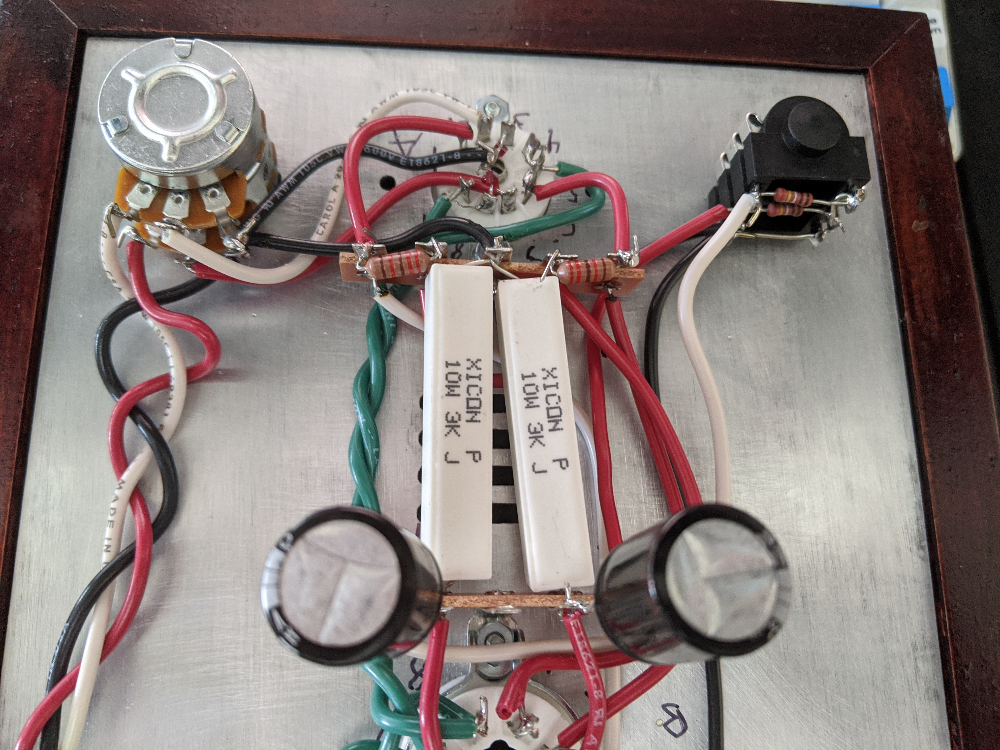

For awhile now i have wanted to build a DIY headphone amp, and i finally got around to doing it!  After looking at various options and reading far too much about which amp might be best for me i settled on the [Bottlehead Crack](https://bottlehead.com/wp-content/uploads/2019/06/Crack1-1-a.jpg). This product in particular got a lot of praise as a fantastic pairing with the headphones that i use, the [Sennheiser HD600](https://www.soundonsound.com/reviews/sennheiser-hd600),

One of the coolest things about this project was it took me outside my comfort zone, I had to do some woodworking which i knew next to nothing about. I lined up and glued the wooden frame together so the cnc aluminum plate would rest cleanly in the rabbet. 

    

Once i had the frame together i wanted to stain it with a bombay mahogany stain/poly blend to both color and protect the wood.  I also spray painted the aluminum plate and the transformer cover a hammered black. If i could do it over again i probably would have used a pure stain vs the stain/poly blend, but for my first stab at something like this i am pretty happy with how it turned out.

  

Now that i had my frame together it was time to actually build the amp!  I mounted the potentiometer, power outlet, RCA jacks, headphone jack, and sockets to the aluminum frame.  On the underside of the plate i also mounted terminal strips to the sockets and around the transformer for all the wiring.  I then clearly marked each of the sockets/terminals so i wouldnt get confused while trying to solder everything together.

  

Now that i had all the terminals and components in place, it was time to start wiring them all together.  We started by wiring in the power terminal to the transformer and sockets, and wiring the ground.  I twisted all the green wire together using a drill, them being twisted helps prevent interference!

Now that we have some power, we can perform a glow test.  I plugged in the tubes to the sockets, and powered everything on.  The slight glow indicates that its getting power correctly and i haven't screwed it up (yet)!

Then we wired the RCA jacks to the potentiometer, again making sure the wires are twisted.  Next soldering it to the tube sockets as well.

Wiring in the [rectifiers](https://en.wikipedia.org/wiki/Rectifier).

Wiring in some [resistors](https://en.wikipedia.org/wiki/Resistor).

Adding the bulky [capacitors](https://en.wikipedia.org/wiki/Capacitor) that were hard to keep placed while soldering them.

Adding the resistors the headphone input jack.

Lastly adding the capacitors/resistors to the terminal and soldering them to the socket connections.  This is the 'busiest' part of the circuit and it was pretty difficult to hold things in place to solder without touching other components. 

The final product after all wiring has been done!! 

Finally i was able to plug my turntable and pre-amp into the amp and i am really happy with it so far, it sounds GREAT!  I'm happily listening to music for now, but in the near future intend to replace the volume knob and feet with aftermarket ones that look a little better.  Additionally the crack has a 'speedball' option i purchased which acts as a camille cascode constant current source.  I'm going to install the upgrade after a few weeks and see how big of a difference it makes!

